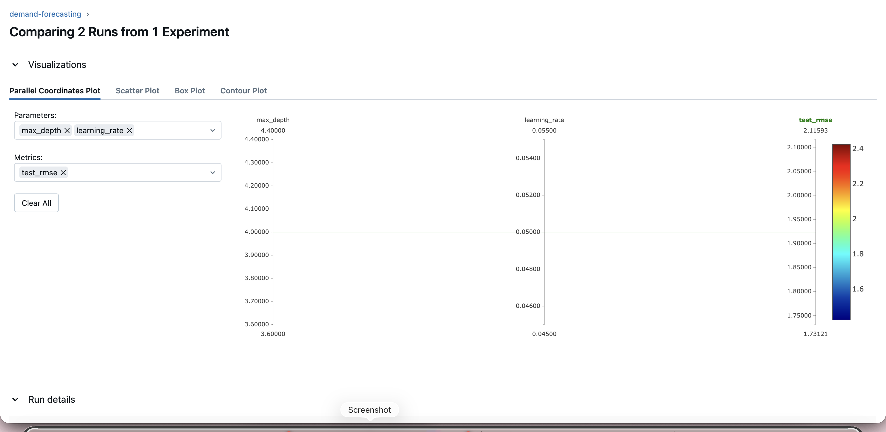
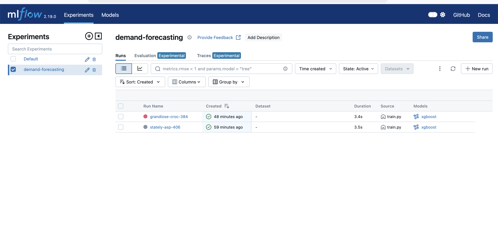
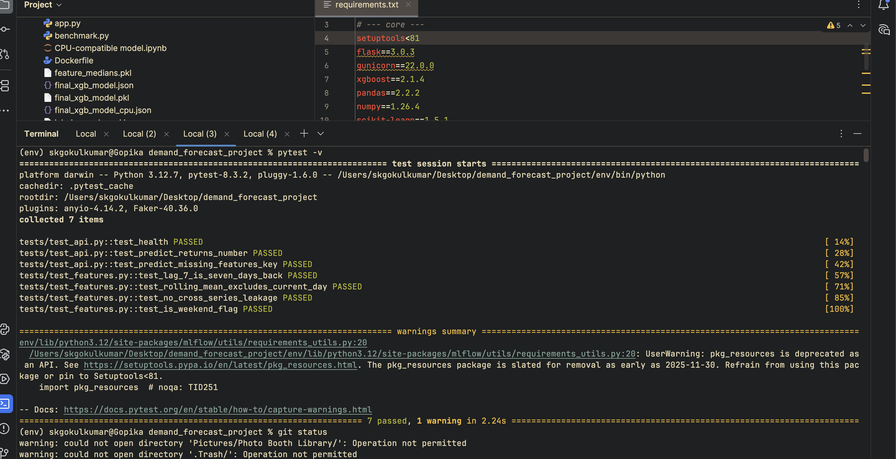
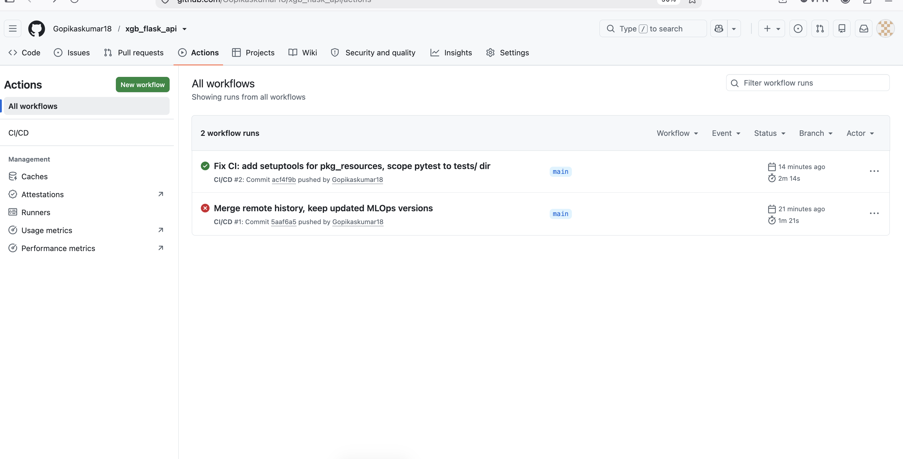

# Large-Scale Product Demand Forecasting with XGBoost — End-to-End MLOps


An **end-to-end retail demand forecasting system** on the M5 (Walmart) dataset, taken from a notebook model all the way to a **tested, tracked, continuously-integrated, and monitored** ML service.

**Headline result: test RMSE of 1.92 on a held-out 28-day window — a 26% improvement over a naive baseline.**

This project covers the full ML lifecycle:
data preprocessing → leak-free feature engineering → time-aware tuning → evaluation against a baseline → **MLflow experiment tracking** → **pytest test suite** → **CI/CD with GitHub Actions** → **Evidently drift monitoring** → Flask API + Docker.

---

## Table of Contents

1. [Problem & Approach](#problem--approach)
2. [Dataset](#dataset)
3. [Feature Engineering](#feature-engineering)
4. [Modeling & Evaluation](#modeling--evaluation)
5. [MLOps: Experiment Tracking (MLflow)](#mlops-experiment-tracking-mlflow)
6. [MLOps: Testing (pytest)](#mlops-testing-pytest)
7. [MLOps: CI/CD (GitHub Actions)](#mlops-cicd-github-actions)
8. [MLOps: Drift Monitoring (Evidently)](#mlops-drift-monitoring-evidently)
9. [Deployment (Flask + Docker)](#deployment-flask--docker)
10. [Project Structure](#project-structure)
11. [Setup & Usage](#setup--usage)
12. [Results Summary](#results-summary)
13. [Future Work](#future-work)

---

## Problem & Approach

Retailers lose money two ways: overstock ties up working capital and drives markdowns, while stockouts lose sales and customers. Accurate SKU-level demand forecasting drives inventory and replenishment decisions.

This project predicts **daily units sold per product-store**.

- **Problem type:** Regression
- **Algorithm:** XGBoost Regressor (`reg:squarederror`, `tree_method="hist"`)
- **Evaluation:** RMSE on a chronologically held-out test set, benchmarked against a naive baseline

---

## Dataset

Based on the **M5 Forecasting Competition** dataset (Walmart, via Kaggle):

- **3,049 products** across **10 stores** in **3 US states** (CA, TX, WI)
- Categories: Foods, Hobbies, Household
- **Daily sales** from 2011-01-29 to 2016-04-24 (1,913 days)
- Three tables: **sales** (wide), **calendar** (dates, events, SNAP flags), **prices** (weekly)

**Preprocessing:** the wide sales table is melted to long format (~58M rows), then joined to the calendar on the day index and to prices on store + item + week.

**Training sample:** a reproducible random sample of products across all categories and stores (fixed seed), keeping the pipeline tractable on commodity hardware.

---

## Feature Engineering

All history-based features are **leak-free** — they only ever look backward.

| Group | Features | Purpose |
|---|---|---|
| **Time** | `d`, `wday`, `month`, `year`, `day_of_week`, `is_weekend` | Trend, weekly & seasonal patterns |
| **Events** | `event_name_1/2`, `event_type_1/2`, `is_holiday` | Holiday & sporting-event demand spikes |
| **SNAP** | `snap_CA`, `snap_TX`, `snap_WI` | Food-assistance benefit days lift grocery demand |
| **Price** | `sell_price`, `price_lag_7`, `price_change_7` | Price level and promotion/elasticity effects |
| **Lag** | `lag_7`, `lag_28` | Sales 7 & 28 days ago (weekly / monthly memory) |
| **Rolling** | `rolling_mean_7`, `rolling_mean_28`, `rolling_std_28` | Recent demand level and volatility |

### Preventing target leakage

Rolling features are built with a shift so the window ends *yesterday*:

```python
df["rolling_mean_7"] = (
    df.groupby("id")["sales"]
      .transform(lambda s: s.shift(1).rolling(7).mean())
)
```

The `.shift(1)` **before** `.rolling()` ensures the current day's sales never leak into its own feature. Categorical encoding and median imputation are both fit on the **training set only**; unseen categories map to `-1`.

---

## Modeling & Evaluation

### Chronological 3-way split

```
2011 ────────────────────────────────► 2016-04-24
│◄──────── TRAIN ────────►│◄ VALID ►│◄ TEST ►│
      (model learns)        28 days   28 days
                            (tuning)  (scored once)
```

The **test set is untouched** during training and tuning — scored exactly once. 28 days matches the M5 forecast horizon.

### Time-aware tuning

Hyperparameters are tuned with `RandomizedSearchCV` using **`TimeSeriesSplit`**, so every fold trains on earlier data and validates on later — no future data leaks backward.

**Best parameters:** 200 trees, `max_depth=4`, `learning_rate=0.05`, `subsample=0.8`, `colsample_bytree=0.7`, `min_child_weight=1`, `gamma=0.1`.

### Baseline comparison

| Metric | Value |
|---|---|
| **Model test RMSE** | **1.92** |
| Naive baseline (predict last week) RMSE | 2.61 |
| **Improvement over baseline** | **26.4%** |

Early stopping halted training at ~round 99–124 of 200, and the test RMSE matched the validation curve — evidence of no overfitting.

---

## MLOps: Experiment Tracking (MLflow)

Every training run logs its parameters, metrics, and the model artifact to MLflow, so configurations can be compared objectively instead of by eyeballing notebook output.

`train.py` logs `test_rmse`, `naive_baseline_rmse`, `improvement_over_baseline_pct`, `best_iteration`, and all hyperparameters, then registers the model with `mlflow.xgboost.log_model`.


*The `demand-forecasting` experiment tracking multiple runs, each logged from `train.py` with the XGBoost model attached.*


*Comparing two runs side by side. Here the hyperparameters (`max_depth`, `learning_rate`) stayed identical across runs while the training sample size changed, so MLflow makes it clear the performance difference came from data scale, not model config.*

Run the UI with:
```bash
mlflow ui --port 5001   # http://127.0.0.1:5001
```

---

## MLOps: Testing (pytest)

A pytest suite guards the pipeline — most importantly against reintroducing **feature leakage**.

| Test | What it protects |
|---|---|
| `test_rolling_mean_excludes_current_day` | **Leakage guard** — fails if the rolling window ever includes today's sales |
| `test_lag_7_is_seven_days_back` | Lag correctness |
| `test_no_cross_series_leakage` | Lags don't bleed between products |
| `test_is_weekend_flag` | Calendar feature correctness |
| `test_health`, `test_predict_returns_number`, `test_predict_missing_features_key` | API behavior |


*All 7 tests passing, including the leakage regression test.*

Run with:
```bash
pytest -v
```

---

## MLOps: CI/CD (GitHub Actions)

On every push, GitHub Actions runs the test suite and then builds the Docker image — tests gate the build, so broken code never ships.


*The CI/CD workflow running automatically on push: Lint & Test, then Build Docker image, both green.*

Workflow file: [`.github/workflows/ci.yml`](.github/workflows/ci.yml)

---

## MLOps: Drift Monitoring (Evidently)

`train.py` saves a reference sample of the training data. `monitoring/drift_report.py` compares incoming (production) data against that reference using **Evidently**, produces an HTML report, and applies a **retraining-trigger rule**: if more than 30% of features drift, the script exits non-zero so a scheduler can kick off retraining.

```
Drifted features: 2/23 (share=0.09)
Report saved to monitoring/drift_report.html
[OK] Drift within tolerance. No retraining needed.
```

Run with:
```bash
python monitoring/drift_report.py
# or against real production data:
python monitoring/drift_report.py --current data/recent_production.csv
```

---

## Deployment (Flask + Docker)

- **Framework:** Flask, served with Gunicorn
- **Endpoint:** `POST /predict` (plus a `/health` check for load balancers)
- **Consistency:** the API loads the model, label encoders, and feature medians saved at training time, so incoming requests are encoded and imputed exactly as in training — no train/serve skew

The `Dockerfile` packages the app, dependencies, and model artifacts to run identically anywhere.

```bash
docker build -t demand-forecast-api .
docker run -p 8080:8080 demand-forecast-api
```

> **Note on cloud deployment:** the API is container-ready for AWS App Runner / ECR (with a `/health` check and `benchmark.py` for p95 latency measurement). Cloud deployment is documented but not kept running to avoid ongoing costs.

---

## Project Structure

```
xgb_flask_api/
├── train.py                     # Training + MLflow logging
├── app.py                       # Flask API (/predict, /health)
├── benchmark.py                 # p50/p95/p99 latency measurement
├── requirements.txt
├── Dockerfile
├── pytest.ini
├── tests/
│   ├── test_features.py         # leakage + feature-logic tests
│   └── test_api.py              # endpoint tests
├── monitoring/
│   ├── drift_report.py          # Evidently drift + retrain trigger
│   └── reference_data.csv       # training reference (auto-created)
├── notebooks/
│   ├── Data_Exploration.ipynb
│   └── Modeling.ipynb
├── .github/workflows/ci.yml     # CI/CD pipeline
├── final_xgb_model.json         # trained model (native format)
├── label_encoders.pkl           # categorical mappings from training
└── feature_medians.pkl          # imputation values from training
```

---

## Setup & Usage

```bash
# Clone
git clone https://github.com/Gopikaskumar18/xgb_flask_api.git
cd xgb_flask_api

# Install (setuptools<81 provides pkg_resources for MLflow)
pip install -r requirements.txt

# Train (logs to MLflow, saves model + artifacts)
python train.py

# View experiments
mlflow ui --port 5001

# Run tests
pytest -v

# Check drift
python monitoring/drift_report.py

# Serve the API
python app.py            # http://127.0.0.1:8080
python test_request.py   # send a sample request
```

> **macOS note:** port 5000 is used by AirPlay Receiver; the API uses 8080 and MLflow uses 5001 to avoid conflicts.

---

## Results Summary

| Area | Result |
|---|---|
| **Model** | Test RMSE **1.92**, **26% better** than naive baseline, no overfitting |
| **Tracking** | MLflow logging every run's params, metrics & model; run comparison |
| **Testing** | 7 pytest tests passing, including a feature-leakage regression guard |
| **CI/CD** | GitHub Actions runs tests + builds Docker image on every push (green) |
| **Monitoring** | Evidently drift report + automated retraining trigger (>30% drift) |
| **Serving** | Flask `/predict` API, `/health` check, Docker-packaged |

---

## Future Work

- Scale training to the full M5 catalog (all 30,490 series)
- Add WRMSSE (the M5 competition metric) to weight items by sales volume
- Multi-step forecasting (recursive or direct per-horizon models)
- Handle intermittent demand with a Tweedie objective or two-stage model
- Deploy to AWS App Runner with a live endpoint and p95 latency SLO
- Schedule the drift check (e.g. a weekly GitHub Actions cron) to auto-trigger retraining

---

## Author

**Gopika Sree Kumar** — [GitHub](https://github.com/Gopikaskumar18)
